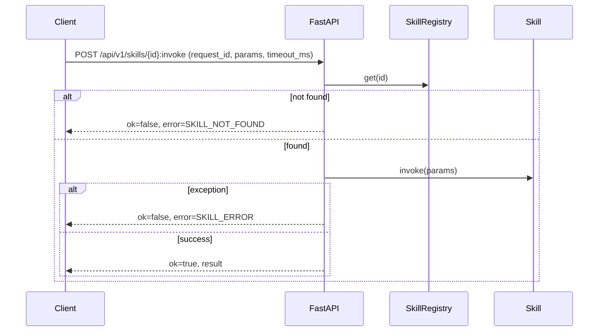

# Skills 模块技术实现文档（后端）

## 架构概览
```mermaid
flowchart LR
  Client[调用方] -->|HTTP JSON| API[FastAPI /api/v1/skills]
  API --> Registry[SkillRegistry]
  Registry --> Skill[Skill.invoke(params)]
  Skill --> VP[VideoProcessingService]
  Skill --> GPU[GPU Probe]
```

## 调用流程


## API 说明
### 1) 列举技能
- `GET /api/v1/skills`
- 返回 `SkillDescriptor[]`

### 2) 调用技能
- `POST /api/v1/skills/{skill_id}:invoke`
- 请求体：`SkillInvokeRequest`
- 响应体：`SkillInvokeResponse`

## 模块边界与代码位置
- Skills 模块（项目根目录）：[skills/registry.py](file:///home/ubuntu/codes/ai_face_change/skills/registry.py) 与 [skills/contracts.py](file:///home/ubuntu/codes/ai_face_change/skills/contracts.py)
- 后端路由适配（FastAPI）：[skills_api.py](file:///home/ubuntu/codes/ai_face_change/blankend/skills_api.py)

## 设计要点
- 保持现有接口兼容：仅新增 `/api/v1/skills` 相关端点。
- 统一输入/输出契约：所有技能使用同一套 request/response/error 结构，便于调用方做统一错误处理与日志追踪。
- 可扩展注册机制：后续可按需扩展动态加载、权限控制、审计日志等能力。

